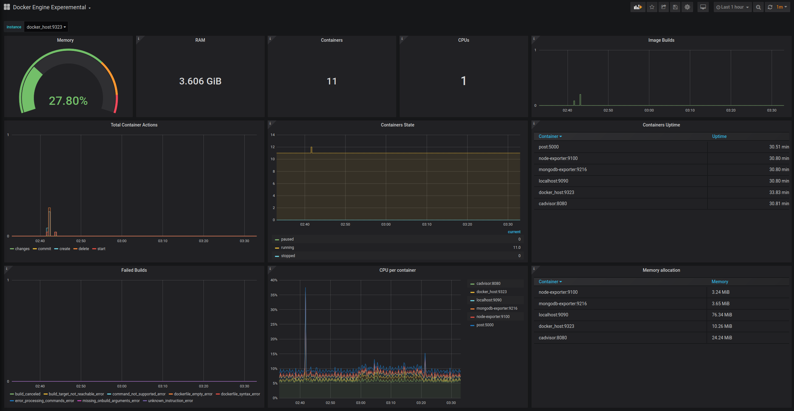
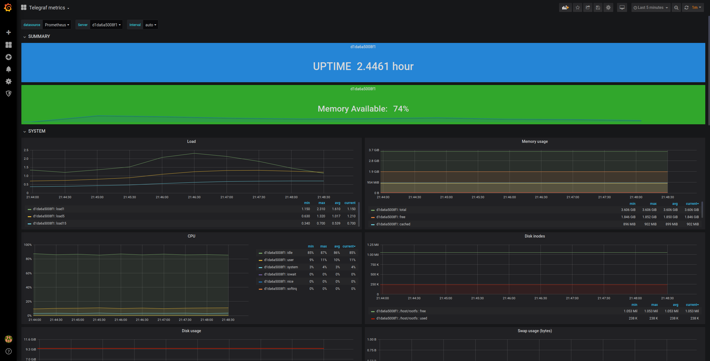
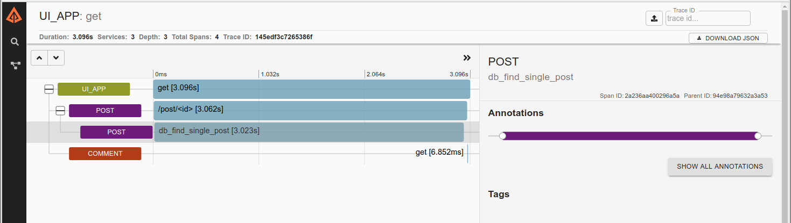
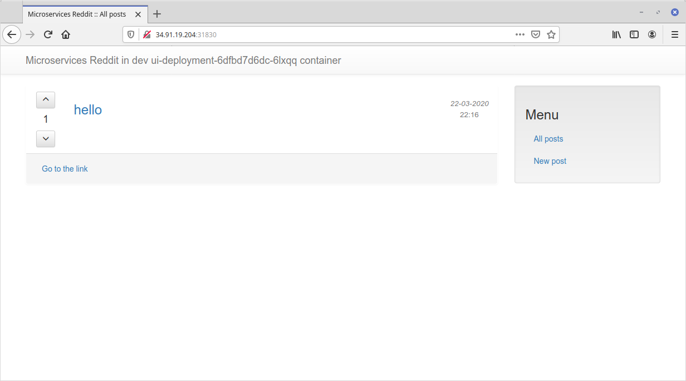

# is217175_microservices
## doker-2
<details>
<summary>Подробнее</summary>

1. Установлена программа *docker-machine* и настроено создание виртуальной машины с *docker* в *GCP*
2. С помощью написанного [Dockerfile](docker-monolith/Dockerfile) собрал образ
```
$ docker image history is217175/otus-reddit:1.0
IMAGE               CREATED             CREATED BY                                      SIZE
a39a9add1cbb        25 hours ago        /bin/sh -c #(nop)  CMD ["/start.sh"]            0B
<missing>           25 hours ago        /bin/sh -c chmod 0777 /start.sh                 146B
<missing>           25 hours ago        /bin/sh -c cd /reddit && bundle install         46.1MB
<missing>           25 hours ago        /bin/sh -c #(nop) COPY file:54cff94402213cfe…   146B
<missing>           25 hours ago        /bin/sh -c #(nop) COPY file:2839de850f5b24a6…   23B
<missing>           25 hours ago        /bin/sh -c #(nop) COPY file:aaad2ee53af2f98d…   191B
<missing>           25 hours ago        /bin/sh -c git clone -b monolith https://git…   115kB
<missing>           25 hours ago        /bin/sh -c gem install bundler                  3.28MB
<missing>           25 hours ago        /bin/sh -c apt-get install -y mongodb-server…   494MB
<missing>           25 hours ago        /bin/sh -c apt-get update                       25.8MB
<missing>           2 weeks ago         /bin/sh -c #(nop)  CMD ["/bin/bash"]            0B
<missing>           2 weeks ago         /bin/sh -c mkdir -p /run/systemd && echo 'do…   7B
<missing>           2 weeks ago         /bin/sh -c set -xe   && echo '#!/bin/sh' > /…   745B
<missing>           2 weeks ago         /bin/sh -c rm -rf /var/lib/apt/lists/*          0B
<missing>           2 weeks ago         /bin/sh -c #(nop) ADD file:4b2eb5cd0b37ca015…   124MB
```

3. Получившийся образ был выгружен в репозиторий Docker Hub - https://hub.docker.com/repository/docker/is217175/otus-reddit
4. Дополнительно были созданы:
- Шаблон *packer* для сборки виртуальной машины с установленным *docker*. Провижин осуществляется при помощи сценария *ansible* [docker.yml](docker-monolith/infra/ansible/docker.yml).
- Шаблон *terraform* для создания инфраструктуры в *GCP* - виртуальных машин из собранного образа и правила для фаервола для работы приложения.
- Сценария *ansible* [run_image.yml](docker-monolith/infra/ansible/run_image.yml) для установки и запуска экземпляра приложения на каждой из созданных виртуальных машин.
- Инвентори *ansible* динамический с плагином *gcp_compute*.
</details>

## docker-3
<details>
<summary>Подробнее</summary>

1. Для сервисов приложения *comment*, *post* и *ui* были созданы *Dockerfile* для сборки
```
$ docker images
REPOSITORY          TAG                 IMAGE ID            CREATED             SIZE
is27175/ui          1.0                 ed6e009f2bbb        11 seconds ago      784MB
is27175/comment     1.0                 b34dbe0c698e        54 seconds ago      782MB
is27175/post        1.0                 109f30e70216        2 minutes ago       110MB
mongo               latest              8e89dfef54ff        9 days ago          386MB
ubuntu              16.04               96da9143fb18        3 weeks ago         124MB
ruby                2.2                 6c8e6f9667b2        21 months ago       715MB
ruby                2.2-alpine          d212148e08f7        22 months ago       107MB
python              3.6.0-alpine        cb178ebbf0f2        2 years ago         88.6MB
```
2. Создал общую сеть для контейнеров приложения `docker network create reddit`
3. Создал *volume* для базы данных, чтобы данные сохранялись при перезапуске контейнера `docker volume create reddit_db`
4. Запуск контейнеров:
```
$ docker run -d --network=reddit --network-alias=db -v reddit_db:/data/db mongo:latest
$ docker run -d --network=reddit --network-alias=post_service -e POST_DATABASE_HOST=db is217175/post:1.0
$ docker run -d --network=reddit --network-alias=comment_service -e COMMENT_DATABASE_HOST=db is217175/comment:1.0
$ docker run -d -p 9292:9292 -e COMMENT_SERVICE_HOST=comment_service -e POST_SERVICE_HOST=post_service --network=reddit is217175/ui:2.0
```
Каждому сервису присвоен сетевой псевдоним опцией `--network-alias=...`, чтобы они могли взаимодействовать по сети. Так контейнеру с базой *mongodb* присвоен псевдоним *db*, сервису комментариев - *comment_service*, сервису постов - *post_service*. Чтобы все все контейнеры знали новые псевдонимы, их имена передаются переменными окружения с опицей `-e VAR=VALUE`
```
$ docker ps
CONTAINER ID        IMAGE                  COMMAND                  CREATED             STATUS              PORTS                    NAMES
e9e725e217b0        is217175/ui:2.0        "puma"                   6 minutes ago       Up 5 minutes        0.0.0.0:9292->9292/tcp   suspicious_mclean
ceba8ef26e0c        is217175/comment:1.0   "puma"                   6 minutes ago       Up 6 minutes                                 thirsty_knuth
3df42256e1d6        is217175/post:1.0      "python3 post_app.py"    6 minutes ago       Up 6 minutes                                 strange_edison
cb93cb96077f        mongo:latest           "docker-entrypoint.s…"   6 minutes ago       Up 6 minutes        27017/tcp                admiring_golick
```
5. Для уменьшения размеров образов применил метод поэтапной cборки *Dockerfile* (тег 2.0 для сервиса *post*, 3.0 - *ui*, 2.0 - *comment*):
```
$ docker images
REPOSITORY          TAG                 IMAGE ID            CREATED             SIZE
is217175/post       2.0                 727000af4f80        14 minutes ago      78MB
is217175/post       1.0                 109f30e70216        26 hours ago        110MB
...
is217175/ui         3.0                 1f2de9005fcf        19 hours ago        44.5MB
is217175/ui         2.0                 e203527390ed        22 hours ago        459MB
...
is217175/comment    2.0                 f33965e17c63        19 hours ago        42MB
is217175/comment    1.0                 b34dbe0c698e        26 hours ago        782MB
```
</details>

## docker-4
<details>
<summary>Подробнее</summary>

1. Установил *docker-compose*
2. Протестировал создание различные типы сетей в *docker*: *none*, *host*, *bridge*.
3. Распределил контейнера приложения по нескольким сетям:
- в *back_net* - *post_db*, *comment*, *post*
- в *front_net* - *ui*, *comment*, *post*
4. Написан [docker-compose.yml](src/docker-compose.yml). Контейнера разнесены по сетям из п.п.3, параметризованы с помощью переменных окружения параметры порт для публикации приложения, версия образов, имя пользователя из репозитория в файле [.env](src/.env.example)
5. Префикс для имени запущенного контейнера задал через переменную окружения *COMPOSE_PROJECT_NAME* в файле [.env](src/.env.example)
6. С помощью файла [docker-compose.override.yml](src/docker-compose.override.yml) переопределил команду для запуска сервера *puma*, а также для всех проектов папка с кодом приложения монтируется в */app* контейнера.

```
$ docker-compose ps
      Name                    Command              State           Ports
---------------------------------------------------------------------------------
reddit_comment_1   puma -w 2 --debug               Up
reddit_post_1      /pyenv/bin/python post_app.py   Up
reddit_post_db_1   docker-entrypoint.sh mongod     Up      27017/tcp
reddit_ui_1        puma -w 2 --debug               Up      0.0.0.0:9292->9292/tcp
```
</details>

## gitlab-ci-1
<details>
<summary>Подробнее</summary>

1. С помощью *docker-machine* создан экземпляр виртуальной машины в *GCP*.
2. На сервер установлен *Gitlab CI* `docker-compose up -d` [docker-compose.yml](gitlab-ci/docker-compose.yml).
3. В *Gitlab CI* был создан проект *homework* и репозиторий в нем *exmaple*
4. *CI/CD Pipeline* настроивается файлом [.gitlab-ci.yml](.gitlab-ci.yml).
5. Запущен и подключен *runner*.
```
docker run -d --name gitlab-runner --restart always \
-v /srv/gitlab-runner/config:/etc/gitlab-runner \
-v /var/run/docker.sock:/var/run/docker.sock \
gitlab/gitlab-runner:latest
...
docker exec -it gitlab-runner gitlab-runner register --non-interactive --tag-list "linux,xenial,ubuntu,docker" --run-untagged=true --locked=false --name "my-runner" --url="http://12.34.56.78/" --registration-token "GjJjfhj*jkhfj_8" --executor "docker" --docker-image alpine:latest --docker-volumes "/var/run/docker.sock:/var/run/docker.sock"
```
Определены стадии *build*, *test*, *review* и соответсвующие задачи для них. Теперь при коммите в репозиторий автоматический запускается конвейер для сборки, тестирования и установки сервиса.
6. Определены окружения *dev*, *stage*, *production*. Окружения stage и production запускаются вручную только для коммитов с тегом (номер версии приложения)
```
...
when: manual
only:
    - /^\d+\.\d+\.\d+/
...
```
7. Определено динамически создаваемое окружение, в зависимости от ветки (кроме ветки master). Для этого используется переменная окружения *CI_COMMIT_REF_NAME*
```
branch review:
  stage: review
  script: echo "Deploy to $CI_ENVIRONMENT_SLUG"
  environment:
    name: branch/$CI_COMMIT_REF_NAME
    url: http://$CI_ENVIRONMENT_SLUG.example.com
  only:
    - branches
  except:
    - master
```
8. В шаг *build* добавлена сборка приложения:
```
build_job:
  image: docker:19.03.1
  before_script:
    - docker info
  stage: build
  script:
    - echo 'Building...'
    - cd reddit/
    - docker build -t reddit:$CI_COMMIT_SHORT_SHA .
```
На *runner* запускается *docker* контейнер, в котором происходит сборка приложения с использованием [Dockerfile](reddit/Dockerfile). Собранному контейнеру присваивается тег *CI_COMMIT_SHORT_SHA* (укороченный хеш последнего коммита).

В *build_job* можно еще добавить загрузку полученного образа в *docker registry*. Но так как разворачивать приложение я буду на этом же сервере, то образ сразу будет доступен.
9. Приложение разворачивается в окружении *dev*:
```
deploy_dev_job:
  image: docker:19.03.1
  stage: review
  before_script:
    - echo "Cleanup previous containers..."
    - docker stop reddit_$CI_ENVIRONMENT_SLUG || true
    - docker stop mongo_$CI_ENVIRONMENT_SLUG || true
    - docker network rm reddit_net_$CI_ENVIRONMENT_SLUG || true
  script:
    - "Deploying..."
    - docker network create reddit_net_$CI_ENVIRONMENT_SLUG
    - docker run --rm -d --name mongo_$CI_ENVIRONMENT_SLUG --network=reddit_net_$CI_ENVIRONMENT_SLUG --network-alias=$DATABASE_URL mongo:latest
    - docker run --rm -d --name reddit_$CI_ENVIRONMENT_SLUG -p 9292:9292 --network=reddit_net_$CI_ENVIRONMENT_SLUG -e DATABASE_URL=$DATABASE_URL reddit:$CI_COMMIT_SHORT_SHA
  environment:
    name: dev
    url: "http://$CI_SERVER_HOST:9292"
    on_stop: stop_deploy_dev
```
Для работы приложения дополнительно должен быть запущен контейнер с базой *mongodb*, создана сеть и определен псевдоним для подключения приложения к базе. В секции `before_script:` определены команды для очистки результатов предыдущего разворачивания. Если *deploy_dev_job* выполняется успешно, то по ссылке http://$CI_SERVER_HOST:9292 можно проверить работу приложения.

В случае остановки окружения определена задача *stop_deploy_dev*. При ее выполнении удаляются контейнеры и сеть, созданные при разворачивании.
```
stop_deploy_dev:
  image: docker:19.03.1
  stage: review
  variables:
    GIT_STRATEGY: none
  before_script:
    - echo "Destroying environment"
  script:
    - docker stop reddit_$CI_ENVIRONMENT_SLUG
    - docker stop mongo_$CI_ENVIRONMENT_SLUG
    - docker network rm reddit_net_$CI_ENVIRONMENT_SLUG
  when: manual
  environment:
    name: dev
    action: stop
```
10. Для автоматизации развертывания *gitlab-runner*:
- Создан шаблон *packer* - [gitlab-runner.json](gitlab-ci/packer/gitlab-runner.json). Сценарий *ansible* [packer.yml](gitlab-ci/ansible/packer.yml) устанавливает *docker* и *gitlab-runner* из официальных репозиториев.
- Шаблон [terraform](gitlab-ci/terraform/) запускает необходимое количество виртуальных машин с вышеуказанным образом. Количество задается переменной *count*. Всем машинам присваивается метка *ansible_group: runners*.
- Создан сценарий [gitlab-runner_register.yml](gitlab-ci/ansible/gitlab-runner_register.yml), который регистрирует виртуальные машины на gitlab сервере. Использовано динамическое инвентори. Сценарий применяется только к группе *runners*. Регистрационный, администраторский токены указаны в групповых переменных [runners.yml](gitlab-ci/ansible/group_vars/runners.yml) (для наглядности не шифровал).
```
cd gitlab-ci
packer build -var-file packer/variables.json packer/gitlab-runner.json
cd terraform
terraform init && terraform apply -auto-approve
cd ../ansible
ansible-playbook gitlab-runner_register.yml
```
11. Уведомления о событиях приходят на мой канал в Slack https://devops-team-otus.slack.com/archives/CS7GWPFQD
</details>

## monitoring-1
<details>
<summary>Подробнее</summary>

1. Микросервисная приложение запущено вместе с контейнером *prometheus*.
2. Метрики собираются с каждого сервиса по *http://.../metrics*
3. Из [docker-compose.yml](docker/docker-compose.yml) убраны директивы *build:*. Сборка сервисов выполняется скриптом:
```sh
for i in ui post-py comment; do cd src/$i; bash
docker_build.sh; cd -; done
```
4. Проверена работа *prometheus*. Все сервисы успешно подключены в мониторинг.
5.  Для мониторинга работы *docker-хоста* используется [node exporter](https://github.com/prometheus/node_exporter).
6. Для мониторинга работы *mongodb* применен [mongodb_exporter]https://github.com/percona/mongodb_exporter) от percona.
7. Добавлен миниторинг сервисов *post*, *ui* и *comment* с помощью *blackbox экспортера*. Он реализует мониторинг по принципу черного ящика.
```
modules:
  http_2xx:
    prober: http
    timeout: 5s
    http:
      valid_http_versions: ["HTTP/1.1", "HTTP/2"]
      valid_status_codes: [200]
      method: GET
      preferred_ip_protocol: "ip4"
      ip_protocol_fallback: false

  icmp_test:
    prober: icmp
    timeout: 2s
    icmp:
      preferred_ip_protocol: "ip4"
```
8. Для сборки и загрузки всех используемых образов написан [Makefile](Makefile).
```sh
make prometheus comment ui post # для сборки и загрузки только указанных образов
make onlypush=1 # для загрузки образов
```
Ссылки на полученные docker-образы:
- https://hub.docker.com/repository/docker/is217175/ui
- https://hub.docker.com/repository/docker/is217175/post
- https://hub.docker.com/repository/docker/is217175/comment
- https://hub.docker.com/repository/docker/is217175/prometheus
- https://hub.docker.com/repository/docker/is217175/mongodb_exporter
- https://hub.docker.com/repository/docker/is217175/blackbox_exporter
</details>

## monitoring-2
<details>
<summary>Подробнее</summary>

1. Из файла *docker-compose.yml* вынесены сервисы мониторинга в файл *docker-compose-monitoring.yml*
2. Создан сервис *cAdvisor* для мониторинга *docker контейнеров*.
3. Создан сервис *grafana* для визуализации собираемых *prometehus* метрик и параметров.
4. Источником данных для *grafana* является *prometehus*. Добавлен из библиотеки дашбоард для визуализации метрик *хоста docker* - [DockerMonitoring.json](monitoring/grafana/dashboards/DockerMonitoring.json).
5. Добавлен дашбоард *UI_Service_Monitoring* для мониторинга количество ошибок 4ХХ и 5ХХ *ui_request_count*, количество http запросов к серивису *ui* - *ui_request_response_time_bucket* и 95-й процентиль времени ответа сервиса *ui* - *ui_request_response_time_bucket*. Дашбоард выгружен в файл [UI_Service_Monitoring.json](monitoring/grafana/dashboards/UI_Service_Monitoring.json).
6. В *prometehus* добавлен сбор метрик с сервиса *post*.
7. Добавлен дашбоард *Business_Logic_Monitoring* для мониторинга количества постов с сервиса *post* и количества комментариев с севриса *comment*. Дашбопрд выгружен в файл [Business_Logic_Monitoring.json](monitoring/grafana/dashboards/Business_Logic_Monitoring.json).
8. Создан сервис *alertmanager* для наблюдения за метриками. Настроена отправка уведомлений о событиях в *slack* (https://devops-team-otus.slack.com/archives/CS7GWPFQD).
9. В конфигурацию *prometeheus* добавлено правило оповещения в файл [alerts.yml](monitoring/prometeheus/alerts.yml):
```yaml
groups:
  - name: alert.rules
    rules:
    - alert: InstanceDown
      expr: up == 0
      for: 1m
      labels:
        severity: page
      annotations:
        description: '{{ $labels.instance }} of job {{ $labels.job }} has been down for more than 1 minute'
        summary: 'Instance {{ $labels.instance }} down'
```
10. Созданный ранее *Makefile* собирает все используемые docker-образы и загружает в репозиторий - https://hub.docker.com/u/is217175.
11. *Демон docker* в экспериментальном режиме может отдавать метрики для мониторинга своей работы. Для включения этой возможности необходимо в файл `/etc/docker/daemon.json` внести настройки:
```json
{
  "metrics-addr" : "127.0.0.1:9323",
  "experimental" : true
}
```
И добавить сбор этих метрик в *prometehus*:
```yaml
...
  - job_name: 'docker_experemental'
    static_configs:
      - targets:
        - 'docker_host:9323'
...
```
Дашбоард для отображения этих метрик [DockerEngineExperemental.json](monitoring/grafana/dashboards/DockerEngineExperemental.json)

12. Создан сервис *telegraf* - агент для сбора метрик от InfluxDB. Мониторинг docker хоста настроен в конфигурационном файле:
```ini
[[inputs.docker]]
    endpoint = "unix:///var/run/docker.sock"
    gather_services = false
    container_names = []
    source_tag = false
    container_name_include = []
    container_name_exclude = []
    timeout = "5s"
    perdevice = true
    total = false
    docker_label_include = []
    docker_label_exclude = []
```
Дашбоард для отображения собранных меток [TelegrafMetrics.json](monitoring/grafana/dashboards/TelegrafMetrics.json)

13. Добавлено еще одно оповещение на превышение времени ответа сервиса *ui*
Описание условия в *alerts.yml*:
```yaml
- alert: HighResponce
  expr: histogram_quantile(0.95, sum(rate(ui_request_response_time_bucket[1m])) by (le)) > 0.1
  for: 1m
  labels:
    severity: page
  annotations:
    description: 'UI high latency'
    summary: 'Too high response time for UI service, more than 0.1 s.'
```
При этом *alertmanager* настроен дополнительно отправлять уведомлени на email:
```yaml
global:
  ...
  smtp_from: alert@gmail.com
  smtp_smarthost: smtp.gmail.com:587
  smtp_auth_username: alert@gmail.com
  smtp_auth_password: password

route:
  receiver: 'slack-notifications'

  routes:
    - match:
        severity: page
      continue: true
      receiver: slack-notifications

    - match:
        severity: page
      receiver: email-notification

receivers:
  ...
  - name: 'email-notification'
    email_configs:
      - to: 'my@example.com'
```
14. В сервис grafana были добавлены изменения, позволяющие автоматически добавлять источники данных и дашбоарды.
В Dockerfile добавлены строки:
```
COPY datasource.yml  /etc/grafana/provisioning/datasources/
COPY dashboards.yml /etc/grafana/provisioning/dashboards/
COPY dashboards/*.json /var/lib/grafana/dashboards/
```
Настройка источника данных *datasource.yml*:
```yaml
apiVersion: 1

datasources:
- name: Prometheus
  type: prometheus
  access: proxy
  orgId: 1
  url: http://prometheus:9090
  isDefault: true
  version: 1
  editable: true
```
Натсройка дашбоардов dashboards.yml:
```yaml
apiVersion: 1

providers:
- name: 'my'
  orgId: 1
  folder: ''
  type: file
  disableDeletion: false
  editable: true
  updateIntervalSeconds: 10
  allowUiUpdates: true
  options:
    path: /var/lib/grafana/dashboards

```
*Grafana* будет сканировать директорию `/var/lib/grafana/dashboards` для поиска дашбоардов.

15. Для сбора с *Google Stackdriver* добавлен сервис *stackdriver* в компоуз файл:
```yaml
stackdriver:
  image: frodenas/stackdriver-exporter:master
  environment:
    - GOOGLE_APPLICATION_CREDENTIALS=/data/google_sa.json
  command:
    - '--google.project-id=docker-123456'
    - '--monitoring.metrics-type-prefixes=compute.googleapis.com/firewall,compute.googleapis.com/instance'
    - '--monitoring.metrics-interval=5m'
  volumes:
    - stackdriver_data:/data
  ports:
    - 9255:9255
  networks:
    - prom_net
```
Удалось собрать собрать метрики указанные в https://cloud.google.com/monitoring/api/metrics_gcp#gcp-compute
16. В приложение были добавлены метрики:
- в сервис *comment* добавлены метрики *comment_body_length* (длина комментария, гистограмма), *comment_db_operation_seconds* (время работы с базой данных, гистограмма, с разделением по меткам для разных операций find, insert)
- в сервис *post* метрика *post_read_db_seconds* немного модифицирована для сбора данных по меткам, в зависимости от операций: find, insert, update.
- в сервис *ui* добавлен счетчик перехода по внешним ссылкам *ui_follow_link*. Для этого немного модифицированы шаблоны и добавлен метод для обработки такого запроса.
17. Создан сервис *trackster* для проксирования запросов от *grafana* к *prometeheus*.
```yaml
  trickster:
    image: tricksterio/trickster:1.0.1
    environment:
      - TRK_ORIGIN=http://prometheus:9090
      - TRK_ORIGIN_TYPE=prometheus
      - TRK_LOG_LEVEL=INFO
      - TRK_PROXY_PORT=9090
      - TRK_METRICS_PORT=8082
    ports:
      - 9091:9090
      - 8082:8082
    networks:
      - prom_net
```
</details>

## Logging-1
<details>
<summary>Подробнее</summary>

1. Создан [docker-compose-logging.yml](docker/docker-compose-logging.yml) файл. В нем описан запуск стека *EFK*. Предварительно собран образ *fluentd* с конфигурационным файлом (https://hub.docker.com/repository/docker/is217175/fluentd).
2. В [docker-compose.yml](docker/docker-compose.yml) внесены изменения. К сервисам *post* и *ui* подключил логирование с драйвером *fluentd*. Теперь эти сервисы отправляют все логи в *fluentd*-сервис.
3. К конфигурационный файл *fluentd* внесены изменения для парсинга принимаемых логов:
```conf
<filter service.post>
  @type parser
  format json
  key_name log
</filter>

<filter service.ui>
  @type parser
  format grok
  grok_pattern %{RUBY_LOGGER}
  key_name log
</filter>

<filter service.ui>
  @type parser
  format grok
  grok_pattern service=%{WORD:service} \| event=%{WORD:event} \| request_id=%{GREEDYDATA:request_id} \| message='%{GREEDYDATA:message}'
  key_name message
  reserve_data true
</filter>

<filter service.ui>
  @type parser
  format grok
  grok_pattern service=%{WORD:service} \| event=%{WORD:event} \| path=%{UNIXPATH:path} \| request_id=%{UUID:request_id} \| remote_addr=%{IP:remote_addr} \| method= %{WORD:method} \| response_status=%{NUMBER:response_status}
  key_name message
  reserve_data true
</filter>
```
4. Через веб-интерфейс *kibana* создан индекс fluentd-*
5. Добавлен сервис распределенного трейсинга *zipkin*. Трассировки запросов можно отследить в веб-интерфейсе сервиса.
6. При работе с "поломанным" приложением обнаружил, что есть значительная задержка при открытии любого поста. С помощью *zipkin* были найдены трейсы медленных запросов:

По трейсу видно, что виной долгой обработки запросы является сервис *post*, имя *span* - *db_find_single_post*. В коде приложения по этим данным был найден метод *find_post*. В его коде найдена причина - вызов функции **time.sleep(3)**. После ее удаления нормальная работа сервиса была восстановлена.
</details>

## Kubernetes-1
<details>
<summary>Подробнее</summary>

1. Созданы шаблоны *контроллера Deployment* для микросервисов приложения *ui*, *comment*, *post* и базы данных *mongodb*.
2. Согласно инструкции [Kubernetes The Hard Way](https://github.com/kelseyhightower/kubernetes-the-hard-way) выполнено развертывание в GCE kubernetes кластера.
3. К кластеру применены файлы шаблоны приложения:
```
$ kubectl get rs -o wide
NAME                            DESIRED   CURRENT   READY   AGE   CONTAINERS   IMAGES             SELECTOR
comment-deployment-5577c57487   1         1         1       41m   comment      is217175/comment   app=comment,pod-template-hash=5577c57487
mongo-deployment-79b8b4c7fc     1         1         1       41m   post-db      mongo:3.2          app=post-db,pod-template-hash=79b8b4c7fc
post-deployment-57988f6847      1         1         1       41m   post         is217175/post      app=post,pod-template-hash=57988f6847
ui-deployment-848ff56f95        1         1         1       41m   ui           is217175/ui        app=ui,pod-template-hash=848ff56f95
```
```
$ kubectl get pods -o wide
NAME                                  READY   STATUS    RESTARTS   AGE   IP            NODE       NOMINATED NODE   READINESS GATES
comment-deployment-5577c57487-grzmd   1/1     Running   0          41m   10.200.0.9    worker-0   <none>           <none>
mongo-deployment-79b8b4c7fc-knzl9     1/1     Running   0          42m   10.200.0.7    worker-0   <none>           <none>
post-deployment-57988f6847-wqbx9      1/1     Running   0          41m   10.200.0.8    worker-0   <none>           <none>
ui-deployment-848ff56f95-bkp27        1/1     Running   0          41m   10.200.0.10   worker-0   <none>           <none>
```
```
$ kubectl get deployments -o wide
NAME                 READY   UP-TO-DATE   AVAILABLE   AGE   CONTAINERS   IMAGES             SELECTOR
comment-deployment   1/1     1            1           41m   comment      is217175/comment   app=comment
mongo-deployment     1/1     1            1           42m   post-db      mongo:3.2          app=post-db
post-deployment      1/1     1            1           41m   post         is217175/post      app=post
ui-deployment        1/1     1            1           41m   ui           is217175/ui        app=ui
```
```
$ kubectl get deployments -n kube-system -o wide
NAME      READY   UP-TO-DATE   AVAILABLE   AGE   CONTAINERS   IMAGES                  SELECTOR
coredns   2/2     2            2           52m   coredns      coredns/coredns:1.6.2   k8s-app=kube-dns
```
```
$ kubectl get pods -n kube-system -o wide
NAME                     READY   STATUS    RESTARTS   AGE   IP           NODE       NOMINATED NODE   READINESS GATES
coredns-5fb99965-5bh6t   1/1     Running   0          52m   10.200.0.2   worker-0   <none>           <none>
coredns-5fb99965-5vt2p   1/1     Running   0          52m   10.200.0.3   worker-0   <none>           <none>
```
</details>

## Kubernetes-2
1. Установлен *minikube* и *kubectl*. С помощью *minikude* развернут локальный кластер.
2. Созданы ресурсы *Deployment* для приложений *ui*, *comment*, *post* и базы данных *mongodb*.
3. Созданы ресурсы *Service* для приложений *comment*, *post* и базы данных *mongodb*.
4. Для обеспечения доступа снаружи применен тип *NodePort* сервиса *ui*.
5. Запущен веб-интерфейс кластера (`minikube dashboard`).
6. Создан новый неймспейс *dev* и в нем развернуты все ранее созданные ресурсы.
7. Создан кластер в среде *GKE* состоящий из двух нод. И добавлено правило фаервола для открытия диапазона tсp портов 30000-32767.
8. В кластере на *GKE* создан неймспейс dev и в нем развернуты все ранее созданные ресурсы. Приложение работает:

9. Веб-интерфейс начиная с версии kubernetes 1.15 более не доступен в *GKE*. Но [ClusterRoleBinding](kubernetes/reddit/kubernetes-dashboard-clusterrolebinding.yml) создан.

```yml
---
apiVersion: rbac.authorization.k8s.io/v1
kind: ClusterRoleBinding
metadata:
  name: kubernetes-dashborard
roleRef:
  apiGroup: rbac.authorization.k8s.io
  kind: ClusterRole
  name: cluster-admin
subjects:
  - apiGroup: core
    kind: ServiceAccount
    name: kubernetes-dashboard
    namespace: kude-system
```
10. Созданы конфигурационные файлы terraform для автоматического создания кластера kubernetes в GKE (ресурсы кластера, пула нод и правила фаервола).
